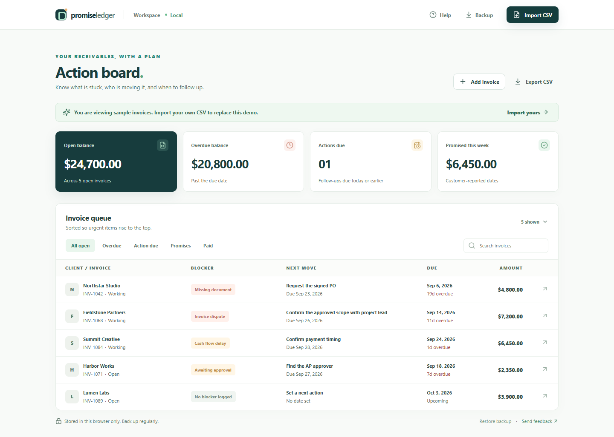

# Duenara

**A local-first invoice resolution board for small B2B service firms.**

Duenara helps one person handling receivables at a small B2B service firm turn an accounts receivable export into a clear follow-up plan: which invoice needs attention, why it remains unpaid, who owns the next step, and what the customer has promised. It prepares email drafts for a person to review and send through their own email client.

**[Try the live prototype](https://akam1123.github.io/promiseledger/)** · [Free AR resources](https://akam1123.github.io/promiseledger/resources/) · [Privacy and data storage](https://akam1123.github.io/promiseledger/privacy/) · [Use terms](https://akam1123.github.io/promiseledger/terms/) · [Read the market thesis](docs/MARKET.md)

**Opening a downloaded copy?** Double-click `index.html`; it opens the self-contained `Duenara-offline.html` beside it. You can also open that offline file directly. Keep both files together if using the redirect. The live and offline copies have separate browser storage, so export a JSON backup if you move work between them.



## What you can do

- Import a flat QuickBooks- or Xero-style accounts receivable CSV export.
- Add an invoice manually when you do not have a CSV.
- Review open invoices and record a reason, owner, next action, and promise date.
- Filter the board to focus on work that is overdue or needs attention.
- Prepare a contextual follow-up email draft for human review.
- Export your working data as CSV or a JSON backup, optionally encrypt the JSON file with a passphrase, and restore either kind of JSON backup.
- Review invoices absent from a later import and invoices marked paid locally that still appear in the new report.
- Preview a CSV before it changes your workspace. The preview shows rows that will be skipped and flags reconciliation items; you must explicitly confirm the import.

The included demo and [sample AR CSV](public/sample-ar-aging.csv) use fictional invoices so you can explore the workflow without importing real customer data.

## Run locally

For development, use a current Node.js LTS release and npm:

```bash
npm install
npm run dev
```

Open the local address printed by the development server. To check or create a production build:

```bash
npm run test
npm run build
```

These commands run from this repository's root. See `package.json` for the exact scripts.

## Basic workflow

1. Choose **Explore sample data**, **Import CSV**, or **Add invoice**. A flat AR CSV up to 2 MB needs customer, invoice number, **remaining amount due**, and due date columns; common header variants are recognized. If both `Amount` and `Balance` columns exist, the importer uses the balance. Dates must be `YYYY-MM-DD` or US `M/D/YYYY`, and amounts are treated as USD. Review the preview and any skipped rows before confirming an import.
2. For each open invoice, record the blocker, responsible teammate, and next action.
3. Capture a customer's promised payment date when one exists.
4. Review an email draft. Copy it or open it in your email app, then check the facts, recipient, and tone before sending.
5. Use **Backup** after making changes. Choose a passphrase-encrypted JSON file for a protected export, or explicitly choose a readable JSON file. Keep the passphrase separately; it cannot be recovered by Duenara. **Export CSV** creates an unencrypted spreadsheet copy. Restore accepts both current formats and older plain JSON backups.
6. On later imports, review the reconciliation warning. The app keeps invoices absent from a new CSV and does not automatically reopen invoices previously marked paid. Confirm those statuses in the ledger. You can delete an invoice from its detail drawer after confirmation.

## Privacy and limits

Duenara is local-first. The prototype has no account, cloud sync, or server-side backup. Working data remains without app-level encryption in this browser on this device; clearing browser storage or changing devices can remove access to it. Use the export function to keep a separate backup. Anyone with access to your browser profile may be able to view the stored data, so use a trusted device and avoid importing information you are not authorized to handle. Optional encryption protects only the downloaded JSON backup, not the live browser workspace, readable JSON backups, CSV exports, or raw recovery downloads.

The temporary GitHub Pages preview shares its browser origin with other paths under `akam1123.github.io`; use fictional or non-confidential data there until the dedicated host is live. JSON backups now include sample status and reconciliation flags. If another tab changes a workspace, the stale tab pauses saving and lets you download its copy before loading the latest version. Keep only one editing tab open on browsers without Web Locks support.

If saved browser data cannot be read, the app pauses changes and offers a download of the unreadable data before you choose to restore a valid backup or discard it. That download is a recovery aid, not a guaranteed repair.

An owner name on an invoice is an organizational label. It does not grant access, assign an account, or notify that teammate.

CSV import is a manual snapshot, and some accounting-system exports may need column cleanup. Reimport retains your notes and invoices absent from the new file; absence does not mean an invoice was paid. A persistent review queue flags absent open invoices and locally paid invoices still in the new CSV. Duenara does not connect to QuickBooks or Xero, verify balances against either system, send email, collect payments, or bill customers. Drafts require a human to review them and decide whether to send them. Treat the accounting system as the source of truth.

See [the product brief](docs/PRODUCT.md) for scope and planned next steps.

## Hosting and risk review

The current public URL is a prototype. A dedicated-host build with root-path links, Cloudflare privacy copy, and strict security headers is ready for an exact claimed hostname; see [hosting status and verification](docs/HOSTING.md). The [security audit](docs/SECURITY_AUDIT.md), [legal/policy risk review](docs/LEGAL_RISK_REVIEW.md), [incident response checklist](docs/INCIDENT_RESPONSE.md), [design QA](docs/DESIGN_QA.md), and [brand check](docs/BRAND.md) record what has been checked and what remains unresolved. [Billing design](docs/BILLING.md) is a planning document; no payment account or live checkout is connected. None is a guarantee of legal immunity or a claim that the new hostname is already live.

GitHub private vulnerability reporting, Dependabot alerts/security updates, and CodeQL default setup are enabled for this repository. The CodeQL scan of commit `bbc209f` passed and marked both findings from the preceding commit as fixed. This is a point-in-time scan, not a guarantee against future vulnerabilities; see the security audit for verification and remaining limits.

## Launch preparation

The [zero-budget marketing plan](docs/marketing/LAUNCH.md), [channel ranking](docs/marketing/CHANNEL_RANKING.md), [copy and creative brief](docs/marketing/ASSETS.md), [AI writing workflow](docs/marketing/AI_WORKFLOW.md), and [measurement sheet](docs/marketing/MEASUREMENT.md) are planning materials. External promotion is on hold at the owner's request: no social posts, outreach, ads, or search-engine submissions have been sent.

## License

MIT. See [LICENSE](LICENSE).
